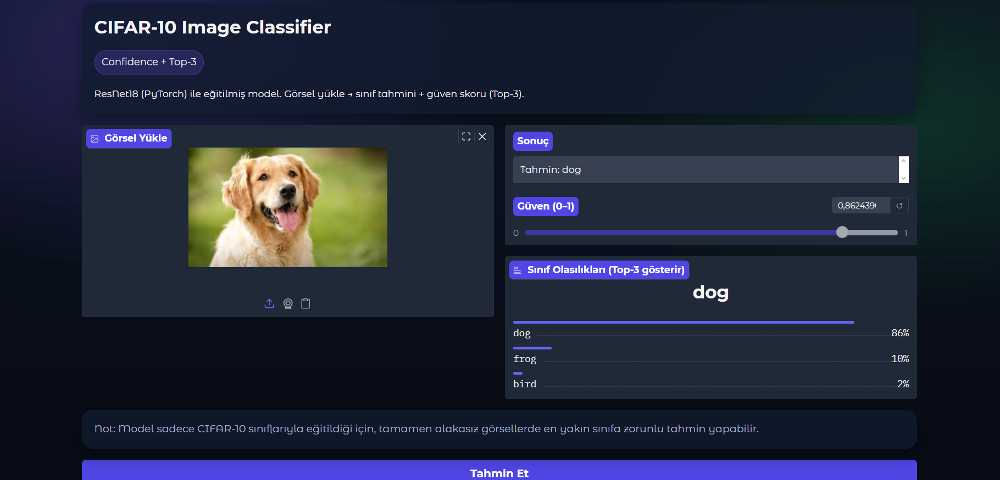

\# CIFAR-10 Veri Seti ile Görüntü Sınıflandırma


Bu projede CIFAR-10 veri seti kullanılarak ResNet18 tabanlı bir görüntü sınıflandırma modeli geliştirilmiştir.

Model, PyTorch framework’ü ile eğitilmiş ve Gradio kullanılarak kullanıcı dostu bir web arayüzü oluşturulmuştur.


Kullanıcı arayüzü üzerinden yüklenen bir görsel için:

\- Sınıf tahmini

\- Güven skoru (confidence)

\- Top-3 sınıf olasılıkları

gösterilmektedir.


---


\## Kullanılan Teknolojiler

\- Python

\- PyTorch

\- Torchvision

\- Gradio

\- CIFAR-10 veri seti


---


\## Metrikler (Test Set)

Modelin başarımı test veri seti üzerinde aşağıdaki metrikler ile ölçülmüştür:


\- Accuracy: 0.8787

\- Precision (macro): 0.8847

\- Recall (macro): 0.8787


---


\## Arayüz Ekran Görüntüsü




---


\## Demo Video

assets/demo.mp4


---


\## Kurulum ve Çalıştırma


```bash

python -m venv .venv

.venv\\Scripts\\activate

pip install -r requirements.txt

python app.py


